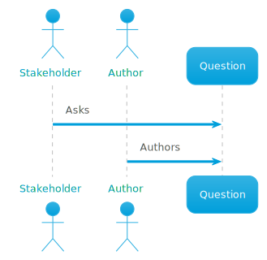
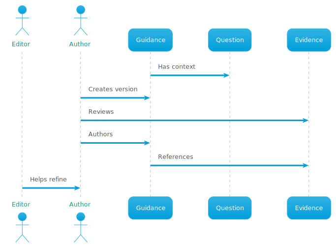
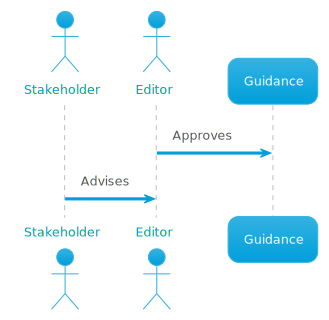

# Modelling a provenance domain with Chronicle

Here we will present a reference domain that uses all the provenance features Chronicle provides and work through the process of representing it using Chronicle's domain modelling syntax. This should help you both understand Chronicle's capabilities and translating your own problem domain's provenance.

Chronicle uses the [W3C Provenance Ontology](https://www.w3.org/TR/prov-o/) as the basis for provenance modelling.

## Reference domain - Medical evidence

This is a toy model of some aspects of evidence based medicine, from an initial `Question` - the area and scope that the organization wishes to research and make guidance on to revisions of a published `Guidance` document. The system is currently handled by a content management system that has identities for documents and users, and we will use Chronicle to add provenance capabilities.

### Question creation

The question for medical evidence can vary pretty widely, but for the purposes of this example imagine it as something along the lines of "How best to assess and refer patients who have required emergency treatment for Anaphylaxis".

Various actors and processes are involved in the production of the question, but for our purposes we van view it like this:



The `Question` is then used to inform the `Research` for the production of `Guidance`.


### Research
The `Question` is used to inform one or more searches to a search engine by a researcher, the parameters to the search engine are recorded, and the results are used to create references to `Evidence`.


#### Revision

Revision, like authorship is triggered by research - in this case for changes or additions to the evidence base. Evidence is used to inform a new revision of the Guidance document



### Publication

A version of Guidance can be approved for Publication by one or more Editors or Stakeholders. Publication produces a digital artifact that can be signed.




## Conceptual design

Provenance is *immutable*. Once you have recorded it there is no way to contradict the provenance you have recorded. When translating your domain to provenance, your activities should be things that have either already take place, or in progress - so choose the past tense. From the process descriptions above we can create the following provenance domain:

### Entities

> In PROV, things we want to describe the provenance of are called entities and have some fixed aspects. The term "things" encompasses a broad diversity of notions, including digital objects such as a file or web page, physical things such as a mountain, a building, a printed book, or a car as well as abstract concepts and ideas.
> An entity is a physical, digital, conceptual, or other kind of thing with some fixed aspects; entities may be real or imaginary.

When determining entities, a useful approach from [process mapping](https://www.bpmleader.com/2012/07/23/introductory-guide-to-process-mapping-modelling/) is to look for nouns in your analysis. Provenance modelling is no different. We can identify the following Entities.

#### Question

The initial question that forms the basis of all research, informing guidance via research.

Has attributes:

* CmdId
* Content

#### Evidence

A reference to evidence gathered from a search engine.

Has attributes:

* SearchParameters
* Reference

#### Guidance

The source text of a document, either in the process of authoring or potentially published.

Has attributes:
* Title
* Revision

#### PublishedGuidance

A published guidance document, containing a digital signature of the released PDF.

Has no attributes.

### Activities

> An activity is something that occurs over a period of time and acts upon or with entities; it may include consuming, processing, transforming, modifying, relocating, using, or generating entities. Just as entities cover a broad range of notions, activities can cover a broad range of notions: information processing activities may for example move, copy, or duplicate digital entities; physical activities can include driving a car between two locations or printing a book.

When determining activities, a useful approach from [process mapping](https://www.bpmleader.com/2012/07/23/introductory-guide-to-process-mapping-modelling/) is to look for verbs in your analysis. Provenance modelling is similar, except we are modelling things that have taken place or are in-progress. It is useful to use past tense for this reason. We can identify:

#### QuestionAsked

The first Activity we need to record, it will Generate a Question.

#### Researched

This activity will model the use of a search engine by a Researcher to produce Evidence.

#### Revised

This activity will model authorship and refinement by an Editor of a single revision of guidance, informed by the Question and Evidence from research.

#### Published

This activity models the publication of a particular revision of Guidance, approved by an editor under the advice of stakeholders.

### Agents

> An agent is something that bears some form of responsibility for an activity taking place, for the existence of an entity, or for another agent's activity.

For our example domain, actors are best modelled as Roles rather than Agents - People and Organizations can participate in multiple ways. So we will specify the following agents:

#### Person

An individual person

#### Organization

A named organization consisting of one or more persons, the details of the organizational model are not required to be recorded in provenance.


### Roles

When participating in activities, when either directly responsible or via delegation, Agents can have a Role. Agents form the who, whereas Roles are the 'what'. Agents may have multiple roles in the same Activity. From our example domain we can identify the following roles:

#### Stakeholder

#### Author

#### Researcher

#### Editor


## Domain model file structure

We will now translate this conceptual design into Chronicle's domain modelling syntax. Chronicle domain models are specified in YAML format, a complete model for the conceptual design can be written like this:

``` yaml
name: 'evidence'
attributes:
  Content:
    type: String
  CmsId:
    type: String
  DOI:
    type: String
  Title:
    type: String
  SearchParameters:
    type: String
  Reference:
    type: String
  Version:
    type: Integer
entities:
  Question:
    attributes:
      - CmsId
      - Content
  Evidence:
    attributes:
      - SearchParameters
      - Reference
  Guidance:
    attributes:
      - Title
      - Revision
  PublishedGuidance:
    attributes: []
activities:
  QuestionAsked:
    attributes:
      - Content
  Researched:
    attributes:
      - SearchParameters
  Evidence:
    attributes:
      - Reference
  Revised:
    attributes:
      - CmsId
      - Version
agents:
  Person:
    attributes:
      - CmsId
  Organization:
    attributes:
      - Title
roles:
  - Stakeholder
  - Author
  - Researcher
  - Editor
```

### Name

A string that names your domain, used to coordinate deployments that require multiple namespaces.

``` yaml
name: "evidence"
```

## Attributes

Attributes are used to assign additional data to the prov terms - `Agent`, `Activity` and `Entity`. They are defined by their name - in the following example `AStringAttribute`, `AnIntegerAttribute` or `ABooleanAttribute`. They are assigned a primitive type of either `String`, `Integer` or `Boolean`. `Integer` is a 32 bit signed integer, `String` and `Boolean` should be self explanatory.

Attribute names should be meaningful to your domain - choose things like 'Title' or 'Description', and they can be re-used between any prov terms.


``` yaml
attributes:
  AStringAttribute:
    type: "String"
  AnIntegerAttribute:
    type: "Integer"
  ABooleanAttribute:
    type: "Boolean"
```

## Agent

Using Chronicle's domain model definitions an Agent can be subtyped and associated with attributes like other provenance terms. In the following example we define two Agent subtypes with a name attribute.

``` yaml
agents:
  Author:
   attributes:
      - Name
  Editor:
    attributes:
      - Name
```

## Entity

entities:
  Artwork:
    attributes:
      - Title
  ArtworkDetails:
    attributes:
      - Title
      - Description

## Activity

``` yaml
activities:
  Exhibited:
    attributes:
      - Location
  Created:
    attributes:
      - Title
  Sold:
    attributes:
      - PurchaseValue
      - PurchaseValueCurrency
  Transferred:
    attributes: []
```


## Role

``` yaml
roles:
  - Buyer
  - Seller
  - Broker
  - Editor
  - Creator
```

*[Guidance]: Authoritative and evidenced recommendations for clinical practice.
